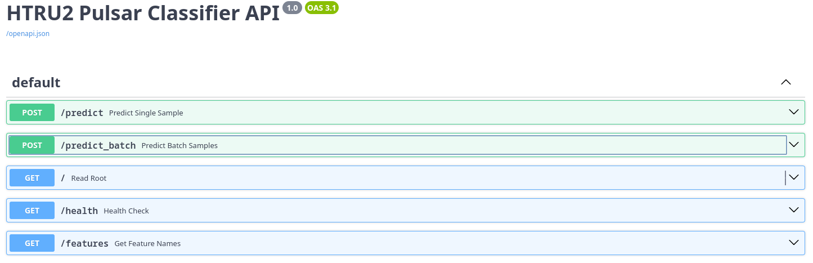
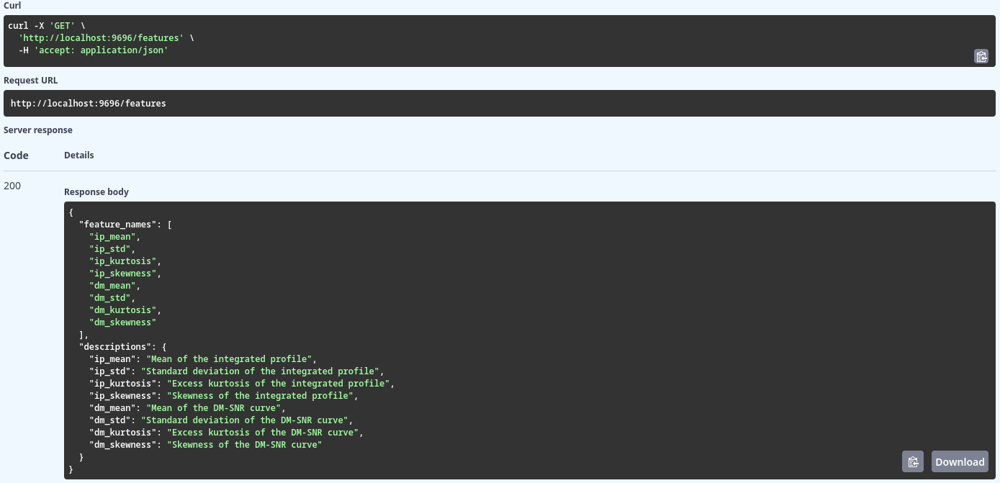
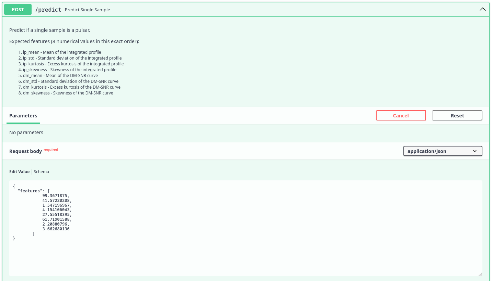
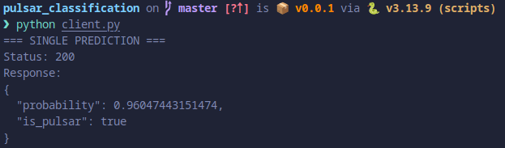
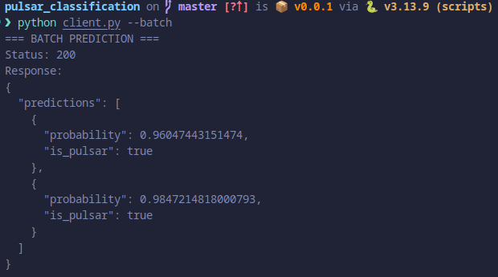

# 🚀 HTRU2 Pulsar Classification - Deployment Guide



## 📋 Overview

This guide covers the deployment and usage of the HTRU2 Pulsar Classification API, a machine learning service that identifies pulsar candidates from radio telescope data.

## 🔧 Quick Deployment

### 1. Build Docker Image

```bash
docker build -t pulsar-classification-api:latest .
```

### 2. Run Container

```bash
docker run -it -p 9696:9696 pulsar-classification-api:latest
```

### 3. Verify Health

```bash
curl http://localhost:9696/health
```

**Response:** `{"status":"healthy","model_loaded":true}`

## 🌐 API Endpoints

### 📊 Available Endpoints


| Method | Endpoint | Description |
|--------|----------|-------------|
| `POST` | `/predict` | Single sample prediction |
| `POST` | `/predict_batch` | Batch samples prediction |
| `GET` | `/` | API information |
| `GET` | `/health` | Service health check |
| `GET` | `/features` | Expected feature names |

## 🔍 Feature Specifications

### Get Expected Features



```bash
curl -X 'GET' 'http://localhost:9696/features' -H 'accept: application/json'
```

**Response:**

```json
{
  "feature_names": [
    "ip_mean",
    "ip_std", 
    "ip_kurtosis",
    "ip_skewness",
    "dm_mean",
    "dm_std",
    "dm_kurtosis",
    "dm_skewness"
  ],
  "descriptions": {
    "ip_mean": "Mean of the integrated profile",
    "ip_std": "Standard deviation of the integrated profile",
    "ip_kurtosis": "Excess kurtosis of the integrated profile",
    "ip_skewness": "Skewness of the integrated profile",
    "dm_mean": "Mean of the DM-SNR curve",
    "dm_std": "Standard deviation of the DM-SNR curve",
    "dm_kurtosis": "Excess kurtosis of the DM-SNR curve",
    "dm_skewness": "Skewness of the DM-SNR curve"
  }
}
```

## 📤 Making Predictions

### Single Prediction



**Request:**

```bash
curl -X 'POST' 'http://localhost:9696/predict' \
  -H 'Content-Type: application/json' \
  -d '{
    "features": [
      99.3671875,
      41.57220208,
      1.547196967,
      4.154106043,
      27.55518395,
      61.71901588,
      2.20880796,
      3.662680136
    ]
  }'
```

**Response:**


```json
{
  "probability": 0.96047443151474,
  "is_pulsar": true
}
```

### Batch Prediction

**Request:**

```bash
curl -X 'POST' 'http://localhost:9696/predict_batch' \
  -H 'Content-Type: application/json' \
  -d '{
    "samples": [
      [99.3671875, 41.57220208, 1.547196967, 4.154106043, 27.55518395, 61.71901588, 2.20880796, 3.662680136],
      [140.0, 45.0, 1.8, 3.9, 25.0, 60.0, 2.1, 3.5]
    ]
  }'
```

**Response:**


```json
{
  "predictions": [
    {
      "probability": 0.96047443151474,
      "is_pulsar": true
    },
    {
      "probability": 0.9847214818000793,
      "is_pulsar": true
    }
  ]
}
```

## 🐍 Python Client Usage

### Single Prediction

```python
python client.py
```

### Batch Prediction  

```python
python client.py --batch
```

## 🎯 Interpretation Guide

### Probability Thresholds

- **≥ 0.5**: Classified as pulsar (`"is_pulsar": true`)
- **< 0.5**: Classified as non-pulsar (`"is_pulsar": false`)

### Confidence Levels

- **0.9-1.0**: High confidence pulsar
- **0.7-0.9**: Moderate confidence pulsar  
- **0.5-0.7**: Low confidence pulsar
- **0.3-0.5**: Possible non-pulsar
- **0.0-0.3**: High confidence non-pulsar

## 🔧 Troubleshooting

### Common Issues

1. **Port already in use**

   ```bash
   docker run -it -p 9698:9696 pulsar-classification-api:latest
   ```

2. **Model file not found**
   - Ensure `best_xgboost_model.pkl` exists in `outputs/models/`

3. **Feature validation errors**
   - Verify exactly 8 features are provided
   - Check feature order matches `/features` endpoint

4. **Docker build failures**

   ```bash
   docker build --no-cache -t pulsar-classification-api:latest .
   ```

### Monitoring

```bash
# Check container status
docker ps

# View logs
docker logs <container_id>

# Health check
curl http://localhost:9696/health
```

