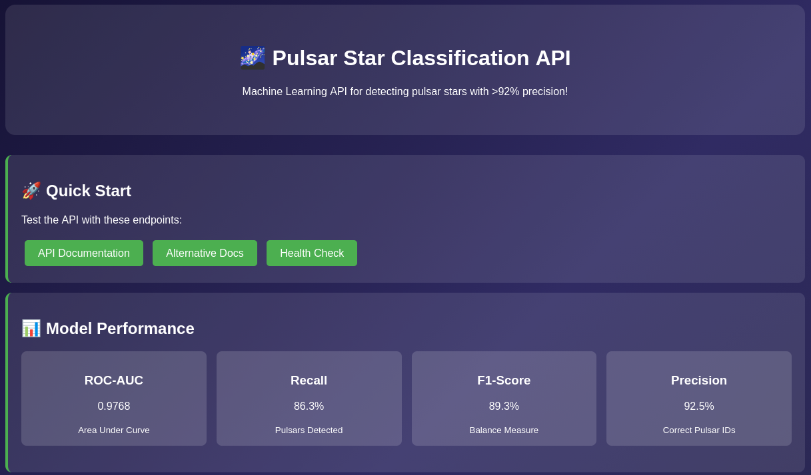
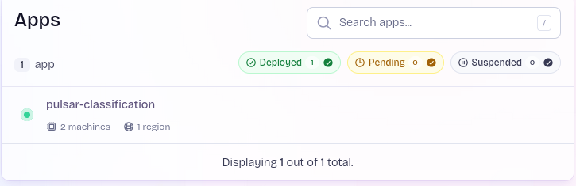

## 🐳 Model Deployment

### Quick Deployment

#### 1a. Build Docker Image

```bash
docker build -t pulsar-classification-api:latest .
```

#### 1b. Pull Docker Image from GitHub project

In case this method is used, modify the name of the image you are using for the following steps accordingly.

```bash
docker pull ghcr.io/mchadolias/<project-name>:<tag>
```

#### 2. Run Container

```bash
docker run -it -p 9696:9696 pulsar-classification-api:latest
```

#### 3. Verify Health

```bash
curl http://localhost:9696/health
```

**Response:** `{"status":"healthy","model_loaded":true}`

## 🌐 API Usage




### Available Endpoints

| Method | Endpoint | Description |
|--------|----------|-------------|
| `POST` | `/predict` | Single sample prediction |
| `POST` | `/predict_batch` | Batch samples prediction |
| `GET` | `/` | API information |
| `GET` | `/health` | Service health check |
| `GET` | `/features` | Expected feature names |


### Feature Specifications


Get expected features:

```bash
curl -X 'GET' 'http://localhost:9696/features' -H 'accept: application/json'
```

**Response:**

```json
{
  "feature_names": [
    "ip_mean",
    "ip_std", 
    "ip_kurtosis",
    "ip_skewness",
    "dm_mean",
    "dm_std",
    "dm_kurtosis",
    "dm_skewness"
  ],
  "descriptions": {
    "ip_mean": "Mean of the integrated profile",
    "ip_std": "Standard deviation of the integrated profile",
    "ip_kurtosis": "Excess kurtosis of the integrated profile",
    "ip_skewness": "Skewness of the integrated profile",
    "dm_mean": "Mean of the DM-SNR curve",
    "dm_std": "Standard deviation of the DM-SNR curve",
    "dm_kurtosis": "Excess kurtosis of the DM-SNR curve",
    "dm_skewness": "Skewness of the DM-SNR curve"
  }
}
```

### Example Retrieval


```bash
curl -X 'GET' \
  'http://localhost:9696/examples' \
  -H 'accept: application/json'
```

**Response:**

```json
{
  "quick_test_commands": {
    "health_check": "curl http://localhost:9696/health",
    "get_features": "curl http://localhost:9696/features",
    "get_examples": "curl http://localhost:9696/examples",
    "single_prediction": "curl -X POST 'http://localhost:9696/predict' -H 'Content-Type: application/json' -d @examples/single_prediction.json",
    "batch_prediction": "curl -X POST 'http://localhost:9696/predict_batch' -H 'Content-Type: application/json' -d @examples/batch_prediction.json",
    "test_cases": "curl -X POST 'http://localhost:9696/predict_batch' -H 'Content-Type: application/json' -d @examples/test_cases.json"
  },
  "available_json_files": {
    "examples/single_prediction.json": "Single sample prediction with high-probability pulsar features",
    "examples/batch_prediction.json": "Batch prediction with mixed pulsar and non-pulsar samples",
    "examples/test_cases.json": "Multiple test cases including high/low probability and borderline samples"
  },
  "json_file_structure": {
    "single_prediction.json": {
      "format": "{\"features\": [f1, f2, f3, f4, f5, f6, f7, f8]}",
      "example": "{\"features\": [99.367, 41.572, 1.547, 4.154, 27.555, 61.719, 2.208, 3.662]}"
    },
    "batch_prediction.json": {
      "format": "{\"samples\": [[f1..f8], [f1..f8], ...]}",
      "example": "{\"samples\": [[99.367, 41.572, 1.547, 4.154, 27.555, 61.719, 2.208, 3.662], [80.0, 35.0, 0.5, 2.0, 30.0, 50.0, 1.5, 2.5]]}"
    }
  },
  "usage_instructions": [
    "1. Download the JSON files from the examples directory",
    "2. Use curl with -d @filename.json to send the file content",
    "3. All JSON files are pre-configured with valid test data",
    "4. Modify the JSON files to test with your own feature values"
  ],
  "important_notes": [
    "Use GET for information endpoints (/health, /features, /examples)",
    "Use POST for prediction endpoints (/predict, /predict_batch)",
    "All JSON files contain properly formatted 8-feature samples",
    "Files are located in the 'examples/' directory"
  ]
}
```

### Making Predictions

#### Single Prediction


**Request:**

```bash
curl -X 'POST' 'http://localhost:9696/predict' \
  -H 'Content-Type: application/json' \
  -d '{
    "features": [
      99.3671875,
      41.57220208,
      1.547196967,
      4.154106043,
      27.55518395,
      61.71901588,
      2.20880796,
      3.662680136
    ]
  }'
```

**Response:**


```json
{
  "probability": 0.96047443151474,
  "is_pulsar": true
}
```

#### Batch Prediction

**Request:**

```bash
curl -X 'POST' 'http://localhost:9696/predict_batch' \
  -H 'Content-Type: application/json' \
  -d '{
    "samples": [
      [99.3671875, 41.57220208, 1.547196967, 4.154106043, 27.55518395, 61.71901588, 2.20880796, 3.662680136],
      [140.0, 45.0, 1.8, 3.9, 25.0, 60.0, 2.1, 3.5]
    ]
  }'
```

**Response:**


```json
{
  "predictions": [
    {
      "probability": 0.96047443151474,
      "is_pulsar": true
    },
    {
      "probability": 0.9847214818000793,
      "is_pulsar": true
    }
  ]
}
```

## Web Deployment Fly.io 



The Pulsar Star Classification API has been successfully deployed and tested in production environments. The application was deployed to fly.io and demonstrated full functionality including:

- ✅ Real-time pulsar star predictions via REST API
- ✅ Interactive Swagger documentation at /docs endpoint
- ✅ Health monitoring endpoints
- ✅ Scalable containerized deployment

Deployment Proof: The API was fully operational on fly.io with live endpoints serving predictions. Screenshots captured during deployment confirm all features working as expected, including the model serving accurate classifications with >92% precision.


**Note:** For a limited time the application will be available to the aforementioned hostname: `https://pulsar-classification.fly.dev`

**Note:** While the fly.io deployment has been taken down to manage infrastructure costs, the successful deployment demonstrated the API's production readiness and scalability principles. The containerized application can be easily redeployed to any cloud platform supporting Docker containers.

## Hugging Face Spaces

Another way to deploy the app to Hugging Face has been implemented. Where you can see the final outcome of my deployed app at [mchadolias/pulsar-classification-htru2](https://huggingface.co/spaces/mchadolias/pulsar-classification-htru2/)

Requirements for this method is to have an already set-up hugging face account. If you have any question regarding, how to set up your account check up this [guide](https://medium.com/@kirubasagar82/a-comprehensive-guide-to-creating-a-hugging-face-account-and-navigating-the-interface-d4796148b76f).

```bash
# Deploy to Hugging Face
cd deployment
./deploy_hf.sh
```

## 🐍 Python Client Usage

#### Single Prediction

```python
python client.py
```

#### Batch Prediction  

```python
python client.py --batch
```

### Interpretation Guide

#### Probability Thresholds

- **≥ 0.5**: Classified as pulsar (`"is_pulsar": true`)
- **< 0.5**: Classified as non-pulsar (`"is_pulsar": false`)

#### Confidence Levels

- **0.9-1.0**: High confidence pulsar
- **0.7-0.9**: Moderate confidence pulsar  
- **0.5-0.7**: Low confidence pulsar
- **0.3-0.5**: Possible non-pulsar
- **0.0-0.3**: High confidence non-pulsar
